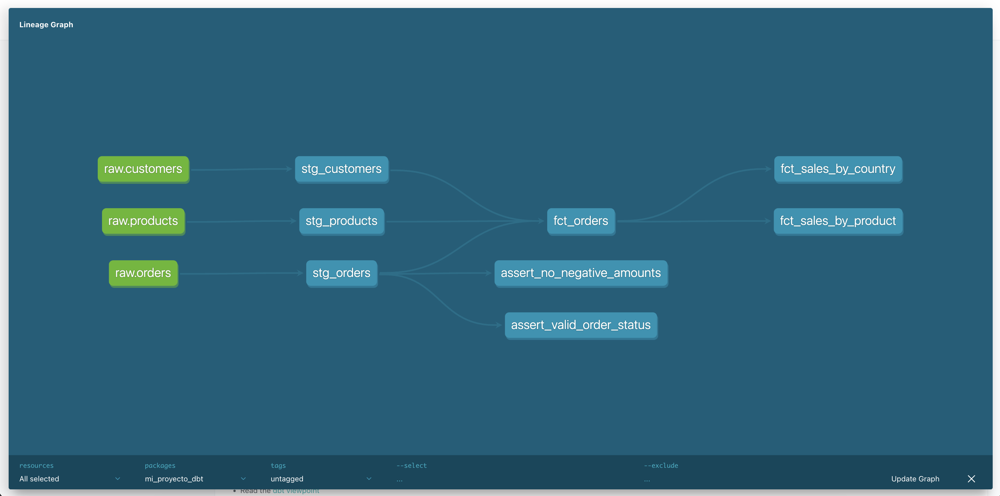

# Ecommerce Analytics - dbt Project

Data engineering project using Airbyte, dbt, MotherDuck, Prefect and Metabase to analyze ecommerce data.

## Pipeline Architecture

```
MySQL (ecommerce) → Airbyte → MotherDuck → dbt → Prefect → Metabase
```

## Stack

- **Airbyte** - Data extraction from MySQL to MotherDuck
- **dbt** - Data transformation and modeling
- **MotherDuck** (DuckDB cloud) - Data warehouse
- **Prefect** - Pipeline orchestration
- **Metabase** - Data visualization

## Data Models

### Staging (`main_staging`)
- `stg_orders` - Orders cleaned and typed
- `stg_customers` - Customers cleaned and typed
- `stg_products` - Products cleaned and typed

### Marts (`main_marts`)
- `fct_orders` - Enriched orders fact table (OBT)
- `fct_sales_by_country` - Sales aggregated by country
- `fct_sales_by_product` - Sales aggregated by product

## Project Structure

```
models/
├── staging/
│   ├── _sources.yml
│   ├── schema.yml
│   ├── stg_orders.sql
│   ├── stg_customers.sql
│   └── stg_products.sql
└── marts/
    ├── schema.yml
    ├── fct_orders.sql
    ├── fct_sales_by_country.sql
    └── fct_sales_by_product.sql
tests/
├── assert_no_negative_amounts.sql
└── assert_valid_order_status.sql
```

## Setup

```bash
pip install dbt-duckdb
dbt deps
```

Configure MotherDuck in `~/.dbt/profiles.yml`

## Running the Project

```bash
dbt deps            # install packages
dbt run             # build models
dbt test            # run tests
dbt build           # run + test
dbt docs generate   # generate documentation
dbt docs serve      # view docs at http://localhost:8001
```

## Orchestration

```bash
python pipeline.py  # run full ELT pipeline with Prefect
```

## Data Sources

1. **MySQL (ecommerce)** - Orders, customers, products via Airbyte
2. **GitHub** - Repository commits

## Testing

- **42 tests total** — all passing
- Generic tests: `unique`, `not_null`, `accepted_values`
- dbt-expectations: value range validation, string length validation
- 2 custom singular tests for business logic

## Data Lineage


