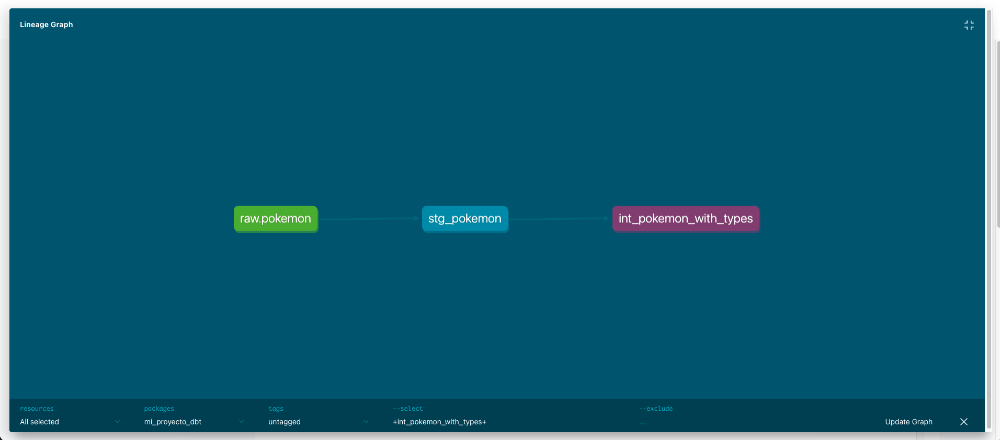

# Pokemon Analytics - dbt Project

Data engineering project using Airbyte, dbt, and MotherDuck to analyze Pokemon data from PokeAPI.

## Project Overview

This project demonstrates an ELT pipeline with the following stack:
- Airbyte for data extraction
- dbt for data transformation
- MotherDuck (DuckDB cloud) as the data warehouse

## Data Models

Two modeling approaches are implemented:

**Star Schema (Dimensional Model)**
- fact_pokemon_stats - metrics and measurements
- dim_pokemon - descriptive attributes
- dim_power_tier - power classification
- dim_type - type catalog

**OBT (One Big Table)**
- obt_pokemon_complete - denormalized table for simple queries

## Project Structure

```
models/
├── staging/
│   ├── _sources.yml
│   ├── stg_pokemon.sql
│   └── stg_commits.sql
├── intermediate/
│   └── int_pokemon_with_types.sql
└── marts/
    ├── dimensional/
    └── obt/
```

## Setup

Install dependencies:
```bash
pip install dbt-duckdb
```

Configure MotherDuck in `~/.dbt/profiles.yml`

## Running the Project

```bash
dbt run          # build models
dbt test         # run tests
dbt docs generate # generate documentation
dbt docs serve   # view docs locally
```

## Data Sources

Data extracted using Airbyte to MotherDuck database `airbyte_curso`:

1. **PokeAPI** - Pokemon data (height, weight, types, stats)
2. **GitHub** - Repository commits from IntDatos26g2

## Data Lineage



The lineage graph shows data flow from sources through staging, intermediate, and mart layers.

## Testing

Includes generic tests, dbt-expectations, and custom singular tests.

## Status

- Star Schema and OBT models implemented
- Staging and intermediate layers complete
- Tests in progress
